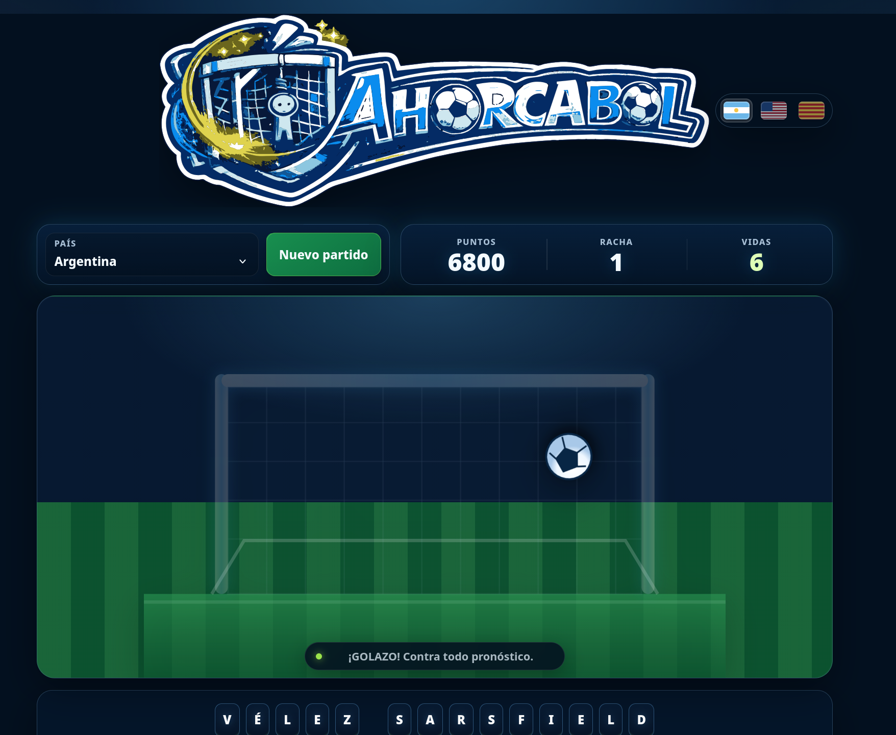

# Ahorcabol

  

  <strong>Football hangman for people whose team did not ruin their day thoroughly enough.</strong>

Ahorcabol is a lightweight browser game about guessing football club names before the hangman catches up with you.

No accounts. No ads. No framework. No build step. Just football, letters, and one more completely unnecessary reason to suffer.

## Play

**Play online:** https://santiagorodriguez.com/Ahorcabol/

## What it does

- Guess current top-flight club names from Argentina, Brazil, England, France, Germany, Portugal and Spain
- Six lives with score, current streak and best streak
- Hint and give-up controls with explicit round-end states
- Shuffle-bag selection to avoid immediate team repeats
- Country / league filtering
- 🇦🇷 **Español** by default
- 🇺🇸 **English**
-  **Català**
- Physical and on-screen keyboard support, including a distinct `Ñ`
- Responsive three-row keyboard on desktop and mobile
- Lightweight goal, post, net and celebration animations
- Optional WebAudio sound effects and SpeechSynthesis voice feedback, controlled separately
- `localStorage` persistence for score, streaks, language, filter and audio preferences
- Plain HTML, CSS and JavaScript with no dependencies

## Club data

`teamlist.json` is the single source of truth for club names.

The pool is aligned to the 2026 Argentine and Brazilian top-flight seasons and the 2026/27 English, French, German, Portuguese and Spanish top-flight seasons.

If the JSON cannot be loaded or its shape is invalid, the game fails closed with a retry control instead of silently using a stale embedded copy.

## Screenshot

  

The screenshot above is from v1.5.0 and will be replaced with the v1.6.0 capture before release.

## Controls

- Select a country / league to restrict the club pool
- Click or tap letters, or use a physical keyboard
- `Hint` reveals one normalized letter and costs one life
- `Give up` reveals the club and resets the current streak
- Changing the country / league during an active round starts a new round and resets the streak
- After a finished round, press `Enter` or use `Next team`

## Scoring

- Correct letter: **+100** per occurrence
- Solved team: **+500 + 50 × remaining lives**
- Hint: no letter points and **−1 life**
- Loss / give up: streak resets to zero

## Run locally

Serve the repository directory with any static web server and open `index.html`.

`teamlist.json` is loaded with `fetch()`, so serving the directory over HTTP is the supported local-development path.

There is no build command. Society remains functional.

## Author

[Santiago Rodriguez](https://santiagorodriguez.com)

## License

GPLv3. See [`LICENSE`](LICENSE).
