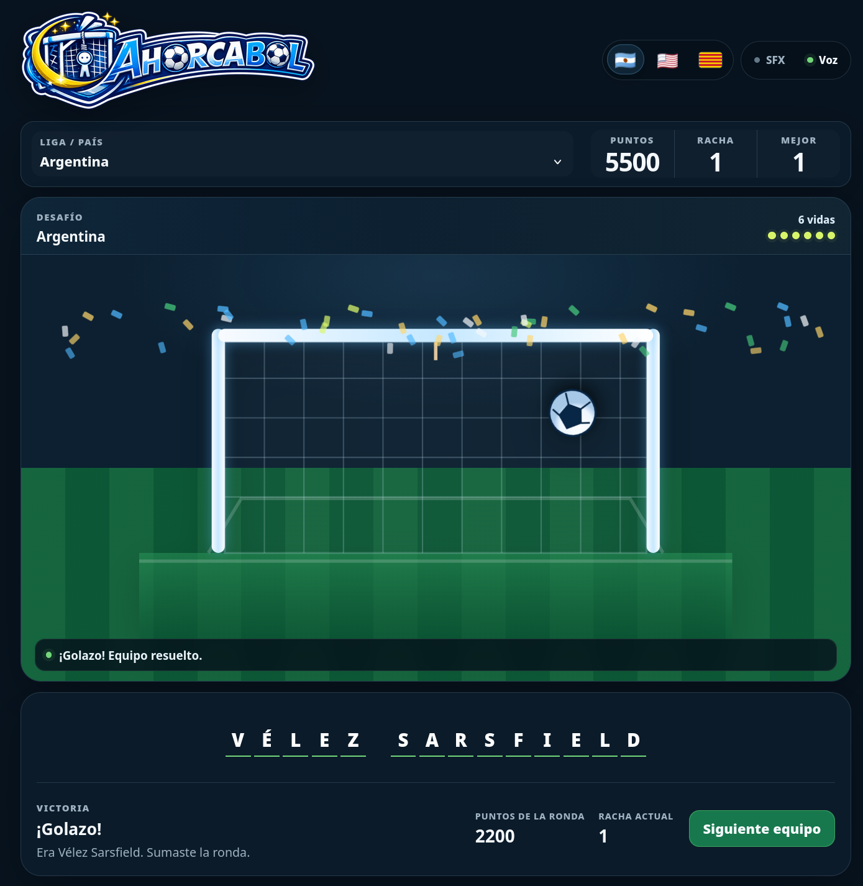

# Ahorcabol

  

  <strong>Football hangman. Fewer tactics, more spelling.</strong>

Ahorcabol is a football version of hangman: pick a league, guess the club, and try not to run out of lives before the name gives up first.

## Play

**Play online:** https://santiagorodriguez.com/Ahorcabol/

## The game

- Pick one league or mix every club into the same bag.
- You get six lives. Wrong letters spend them; hints are not exactly charity either.
- Wins add points and keep your streak alive. Losing, giving up, or changing leagues mid-round does not.
- Play with the on-screen keyboard or a physical one. `Ñ` gets its own key, as it should.
- Sound effects and voice are optional.
- The club pool is shuffled, so the same team should not immediately come back to haunt you.

### Languages

- 🇦🇷 **Español**
- 🇺🇸 **English**
-  **Català**

## Clubs

The game includes clubs from Argentina, Brazil, England, France, Germany, Portugal, Spain and MLS.

`teamlist.js` is the club list used by the game. It currently follows the 2026 Argentine, Brazilian and MLS seasons and the 2026/27 English, French, German, Portuguese and Spanish top-flight seasons.

## Offline

Download the repository ZIP, extract it, and open `index.html` directly. That's it.

Everything needed to play is local. A static web server still works too, if you feel like making hangman slightly more official.

## Screenshot

  

## Author

[Santiago Rodriguez](https://santiagorodriguez.com)

## License

GPLv3. See [`LICENSE`](LICENSE).
