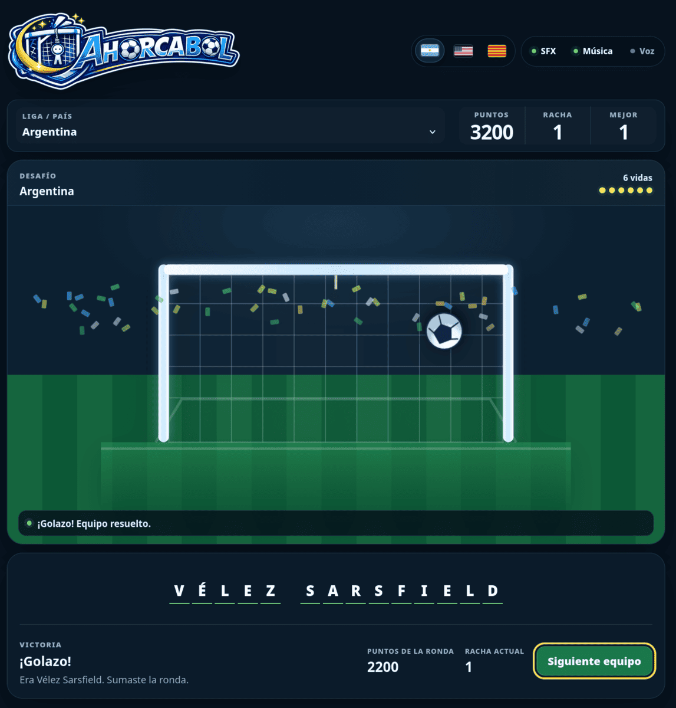

# Ahorcabol

<p align="center">
  
</p>

<p align="center">
  <strong>Football hangman. Fewer tactics, more spelling.</strong>
</p>

Ahorcabol is a football version of hangman: pick a league, guess the club, and try not to run out of lives before the name gives up first.

## Play

**Play online:** https://santiagorodriguez.com/Ahorcabol/

## What's new in 1.8.0

- Original synthesized effects and lightweight background music with separate controls.
- Music enabled by default; saved choices are respected and playback waits for interaction.
- Reliable audio cancellation when muted or hidden, with quieter music during voice feedback.
- Letter-specific feedback, explicit hidden-letter labels and calmer decorative motion.
- Smaller runtime branding assets and dependency-free local checks.


## The game

- Pick one league or mix every club into the same bag.
- You get six lives. Wrong letters spend them; hints are not exactly charity either.
- Wins add points and keep your streak alive. Losing, giving up, or changing leagues mid-round does not.
- Play with the on-screen keyboard or a physical one. `Ñ` gets its own key, as it should.
- Sound effects, music and voice have independent controls.
- The club pool is shuffled without repeats until exhausted during a session. Changing language keeps its order. Reloading rebuilds the pool but avoids an immediate repeat.

### Languages

- 🇦🇷 **Español**
- 🇺🇸 **English**
-  **Català**

## Clubs

The game includes clubs from Argentina, Brazil, England, France, Germany, Portugal, Spain and MLS.

`teamlist.js` is the club list used by the game. It currently follows the 2026 Argentine, Brazilian and MLS seasons and the 2026/27 English, French, German, Portuguese and Spanish top-flight seasons.

## Offline

Download the repository ZIP, extract it, and open `index.html` directly. That's it.

Everything needed to play is local. A static web server still works too, if you feel like making hangman slightly more official.

## Development checks

No installation or build step is needed to play. With Node.js 22 or later, run
the checks locally:

```sh
node --check audio.js
node --check script.js
node --check teamlist.js
node --test tests/*.test.cjs
```

The dependency-free tests execute the game runtime with a small DOM adapter
and exercise the audio controller with a fake audio clock/backend.
They cover scoring, hints, round outcomes, persistence recovery, keyboard input,
localization, the shuffle bag and catalog playability. They do not replace
browser checks for layout, focus behavior, speech/audio or screen readers.

Before releasing, check narrow mobile and desktop layouts in a browser, all three
languages, keyboard/touch input, reload recovery and direct `file://` play.
Storage and speech availability depend on the browser; gameplay works without them.

Effects and an original eight-bar background loop are synthesized locally in
the optional classic script `audio.js`, under the project license.
Audio starts only after a play action or explicit audio activation. Muting, starting
another round, or hiding the page cancels pending effects. Returning to the page
requires another play action to resume sound. A blocked audio backend never
prevents gameplay or erases the saved sound preference. Voice remains independent.
Music defaults on when no valid preference exists; an explicit saved off choice
is preserved. It has its own toggle, separate from SFX and voice. Its
saved preference never autoplays on reload: play or select Music once to start.
While playing or preparing, selecting Music turns it off; a paused channel can
be resumed with one click. The highlighted toggle reflects the saved choice,
and its status explains when playback is waiting or preparing. On first use, OfflineAudioContext renders one mono 32 kHz buffer
(about 17 seconds / 2.1 MiB), reused across rounds without downloading audio.
Music stays quiet and ducks during speech and terminal effects. Hiding the page
stops playback until another play action. Unsupported/failed music leaves the
other channels and game usable.
Audio tests cover scheduling and cancellation, not perceived sound quality;
audition cues and at least three music loops with voice, verify interruption/
recovery, and measure first-use latency on a phone before releasing.

## Screenshot

<p align="center">
  
</p>

## Author

[Santiago Rodriguez](https://santiagorodriguez.com)

<a href="https://santiagorodriguez.com/donate"></a>

## License

GPLv3. See [`LICENSE`](LICENSE).

